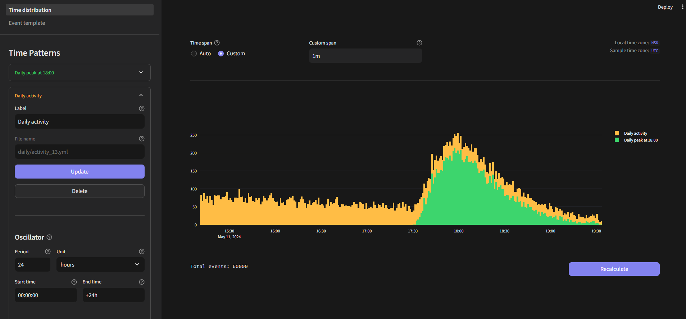

# Overview

## What is Eventum

**Eventum** is a flexible event generator that provides synthetic data for various purposes.

The most popular tasks where Eventum is used are:
- Generation of datasets
- Simulation of processes in real time
- Filling different systems with demo data
- Testing on arbitrary data and stress testing


## How it works
The working pipeline of Eventum consists of three parts:
- **Input plugin** - it creates signals in time represented as timestamps
- **Event plugin** - for each incoming signal, renders the event according to the template
- **Output plugin** - sends generated events to specified endpoints
 


Thus, to launch the application you only need to set parameters for these three parts in a single configuration file.

You may notice that parts are called "plugins". It is so because in addition to using existing ones, you can develop your own plugins and use them easily.

## Events Scheduling 
### Time modes
Eventum supports two time modes:
- **Sample mode** - it is applicable when you want to generate events without reference to the present time (e.g. create a dataset)
- **Live mode** - in this case, each event will be published as the present time passes event timestamp

### Scheduling methods
With the variety of input plugins you can flexibly adjust when to generate the events. For example, in case when events linearly spaced in time you can use **Timer input plugin** for live mode and **Linspace input plugin** for sample mode. For more detailed uncomplicated scheduling the **Cron input plugin** is a great choice. If you want maximum flexibility, then just use **Time patterns input plugin** which offers you to operate probability distribution functions and mix them if needed. There are many others plugins, you can explore all them [here](./index.md).

## Event Templates
### Stateful rendering
In the default event plugin (called **Jinja event plugin**) Eventum uses Jinja template engine. With basic use of Jinja, we cannot access variables from previous template renders. But with **[State API](./index.md)** of **Jinja event plugin** it is easy to achieve it.

Template:
```javascript
// highlight-next-line


{
    "userID": {{ id }}
}

// highlight-next-line

```

Output:
```json
// first render
{
    "userID": 1,
}
// second render
{
    "userID": 2,
}
```

### Use your own samples 
It's easy to use data samples in templates because Jinja event plugin provides **[Sample API](./index.md)**.

Need to change data in your events? - Just update your sample and keep template without any changes.

Template:
```javascript
// highlight-next-line




{
    "sampleRow": "{{ computer }}",
    "hostname": "{{ hostname }}",
    "ip": "{{ ip }}"
}
```

Output:
```json
{
    "sampleRow": "('wks02', '172.16.0.4')",
    "hostname": "wks02",
    "ip": "172.16.0.4"
}
```

In the above example, sample `computers` is accessed by its alias which is set along with the csv file path in application configuration.

### Connect to reality
Eventum is not only about synthetic data. You can run subprocesses and obtain their result in templates using **[Subprocess API](./index.md)**.

Template:
```javascript
// highlight-next-line


{
    "name": "Shell says, that I'm {{ my_name }}"
}
```

Output:
```json
{
    "name": "Shell says, that I'm Nikita Reznikov"
}
```

### Use modules
You are able to write any python function and run it from template just referencing to it using **module** keyword. For example there is default module named **[`rand`](./index.md)** with different functions for generating random values.

```javascript
// highlight-next-line


{
    "ip": "{{ ip }}"
}
```
Output:
```json
{
    "ip": "244.203.128.130"
}
```

Content of `rand.py`:
```py
...
class network:
    @staticmethod
    def ip_v4() -> str:
        """Return random IPv4 address."""
        return '.'.join(str(random.randint(0, 255)) for _ in range(4))
...
```

The only thing you need to do to make this work is to put your python module to `jinja_modules` directory of Jinja event plugin. All modules in this directory are accessible from all templates.

## Outputting
### Send events anywhere
Direct your generated events with output plugins easily. Use different destinations like stdout, files, OpenSearch. There is also the possibility to specify multiple destination per running instance of Eventum. That gives you the flexibility to manage and utilize your data as needed.

## Designing with Eventum Studio

**Eventum Studio** is the important part of Eventum that empowers you to develop content such as time distribution configurations and event templates in user friendly way.

Using Eventum Studio you can change parameters of distributions and visualize the result on the fly.


It's available to edit event templates and define configurations for them. 


Once template is ready you can render it with pretty highlighting to test if the resulting event is constructed properly.


Once you are done with it, you can save template to file directly from Eventum Studio interface.

---

<p align="center">
    👾 Are you ready to use Eventum? Proceed with installation! 👾
</p>